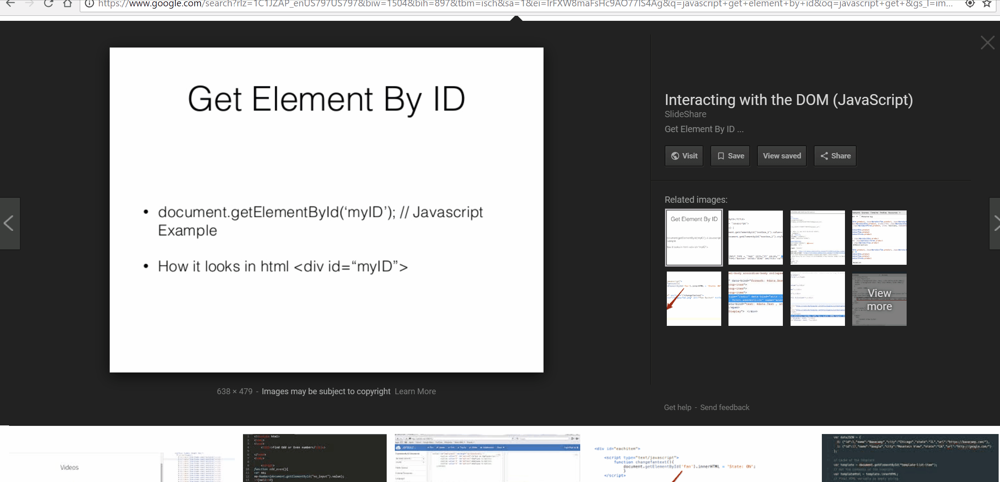

# Paste From Screenshot

Paste text from images using OCR.

## Features

Using the command "Paste From Screenshot", enter the image url and a hit enter. The image will be processe and a new text file will open with the extracted text content.

## Requirements

To use this extension, you must be connected to the internet.

## Known Issues

Does not get image from clipboard as of yet.

## Release Notes

### 0.0.1

Initial release of Paste from Screenshot.